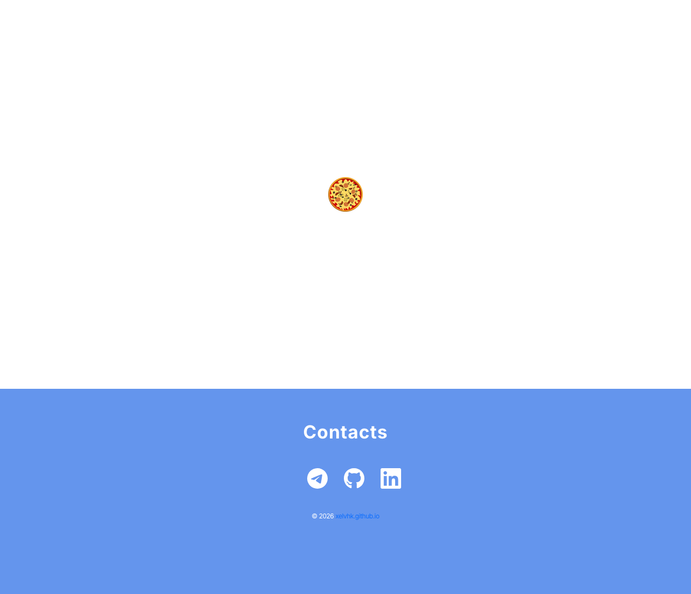
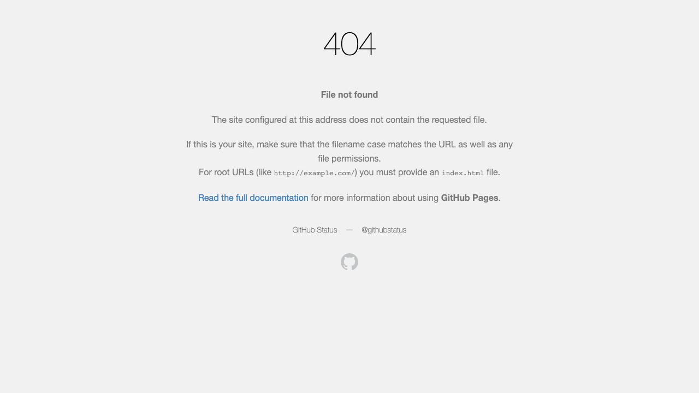
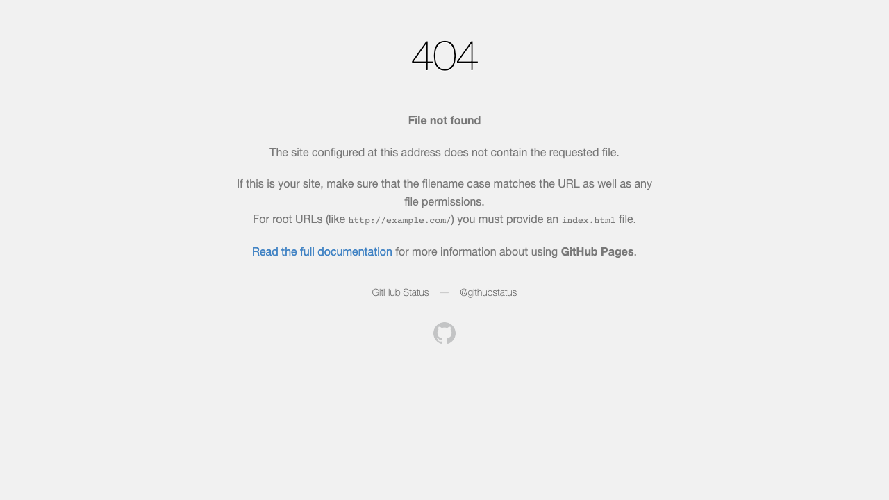

# aboutme

React portfolio with automatic GitHub project sync, bilingual content (RU/EN), and GitHub Pages deployment.

## Problem
A portfolio should stay up to date without manual copy-paste after every repository update. `aboutme` solves this by loading repositories directly from GitHub API and merging them with manually curated content.

## Stack
- React 18
- React Router
- React Bootstrap
- LocalStorage-based CMS adapter
- GitHub Pages (`gh-pages`)

## Quick Start
```bash
git clone https://github.com/xelvhk/aboutme.git
cd aboutme
npm install
cp .env.example .env
npm start
```

## Environment
Create `.env` from `.env.example`:
```env
REACT_APP_GITHUB_USER=xelvhk
```

## Architecture
- `src/pages/`: Home, Projects, Blog, Contact pages
- `src/components/`: reusable UI blocks
- `src/data/cms.js`: local CMS + GitHub sync/cache logic
- `src/data/translations.js`: RU/EN content
- `src/helpers/projectsList.js`: local fallback projects

## Demo / Screenshots
- Production: [https://xelvhk.github.io/aboutme/](https://xelvhk.github.io/aboutme/)
- Home

- Projects

- Blog


## Roadmap
- [ ] Add project filtering by tags/topics from GitHub
- [ ] Add skeleton loading states for project cards
- [ ] Add integration tests for CMS adapter behavior
- [ ] Add lightweight admin flow for blog post media

## CI
Minimal CI is configured in `.github/workflows/ci.yml`:
- `npm ci`
- `npm run build`
